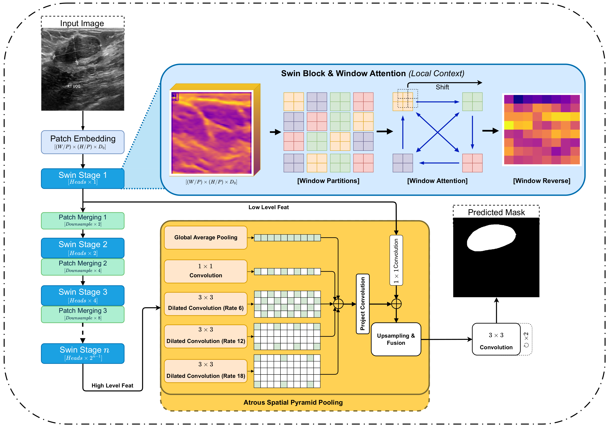
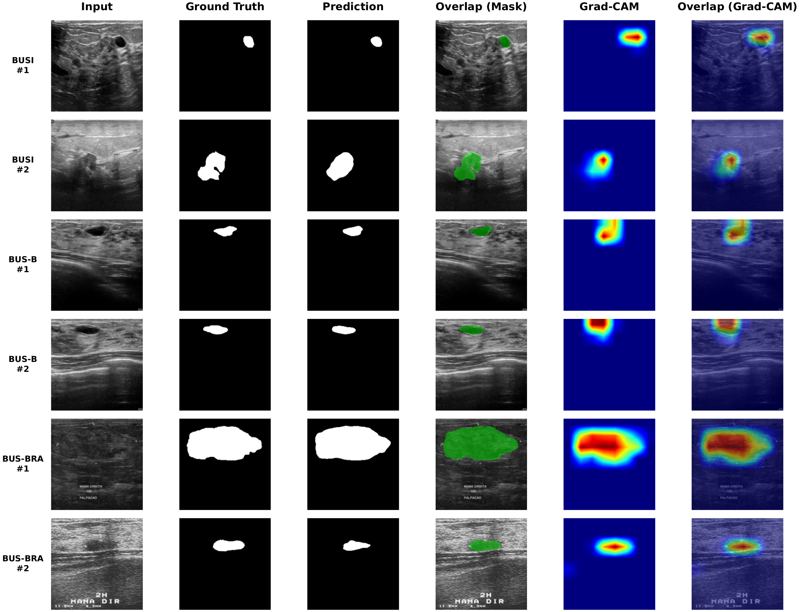
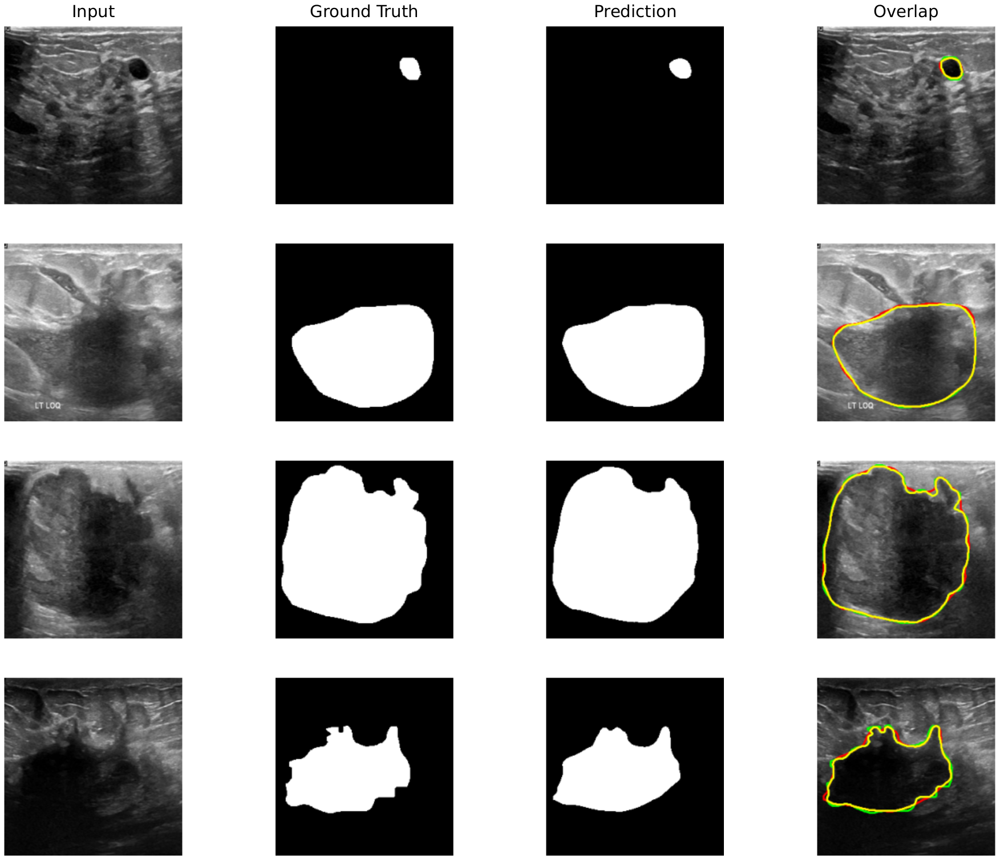
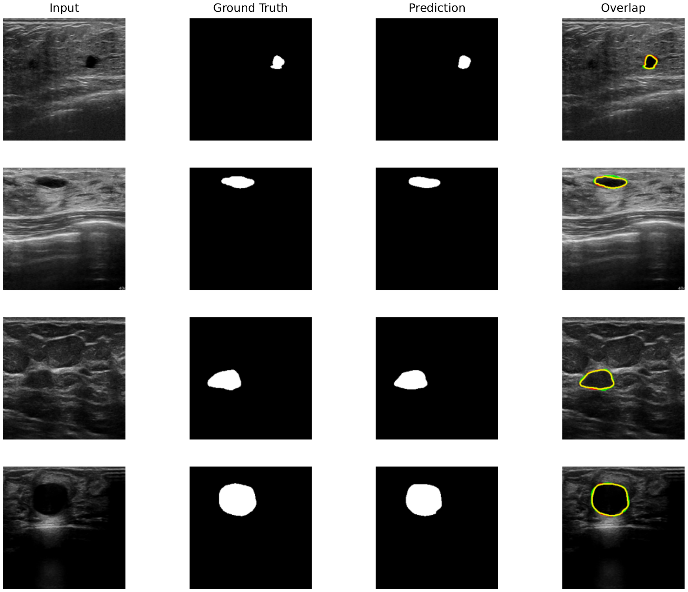
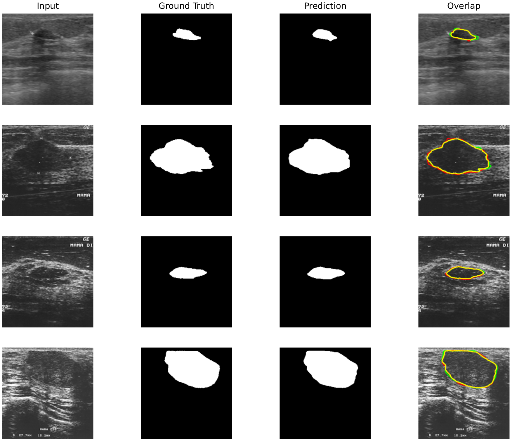

# Swin-DeepLabV3

[](LICENSE)
[](https://www.python.org/)
[](https://www.tensorflow.org/)

TensorFlow/Keras implementation of **Swin-DeepLabV3** for breast ultrasound lesion segmentation.

> **Paper:** *Swin-DeepLabV3: Enhanced Semantic Segmentation Through Global-Local Feature Fusion Using Swin Transformer and Atrous Spatial Pyramid Pooling*  
> **Authors:** Tran Cao Minh, Ha Minh Tan, Kien Cao-Van, Nguyen Huynh Thong, Si Duy Truong, Thi Ngoc My Truong, Dinh Thang Nguyen, and Tuan Anh Huynh  
> **Status:** Manuscript under review  
> **Year:** 2026

---

## Overview

Swin-DeepLabV3 is a hybrid semantic segmentation architecture that combines:

- a hierarchical **Swin Transformer** encoder for global and multi-scale feature representation;
- an **Atrous Spatial Pyramid Pooling (ASPP)** module for multi-scale contextual aggregation;
- a lightweight decoder with skip connections for recovering lesion boundaries and spatial details.

The method is evaluated on three breast ultrasound datasets: **BUSI**, **BUS-B**, and **BUS-BRA**.

### Key Features

- Swin Transformer encoder with shifted-window self-attention
- ASPP context module with multiple dilation rates
- Skip-connected lightweight decoder
- Dice, focal, binary cross-entropy, and BCE–Dice losses
- Streaming Dice and IoU metrics
- Training, evaluation, inference, and TensorBoard support
- Preprocessing scripts for BUSI, BUS-B, and BUS-BRA

---

## Architecture



*The Swin Transformer encoder extracts hierarchical low-level and high-level features. The ASPP module aggregates multi-scale context, while the decoder combines semantic and spatial information to produce a binary lesion mask.*

```text
Input image (256 × 256 × 3)
        │
        ▼
┌──────────────────────────────┐
│ Swin Transformer Encoder     │
│ Patch embedding              │
│ 4 hierarchical stages        │
│ Shifted-window attention     │
└──────────────┬───────────────┘
               │
               ├── Low-level features
               │
               └── High-level features
                         │
                         ▼
┌──────────────────────────────┐
│ ASPP Context Module          │
│ Dilation rates: 6, 12, 18    │
└──────────────┬───────────────┘
               │
               ▼
┌──────────────────────────────┐
│ Lightweight Decoder          │
│ Upsampling + skip fusion     │
└──────────────┬───────────────┘
               │
               ▼
Binary segmentation mask
(256 × 256 × 1)
```

| Component | Configuration |
|---|---|
| Input size | `256 × 256 × 3` |
| Encoder | Swin-T |
| Embedding dimension | `96` |
| Encoder depths | `[2, 2, 6, 2]` |
| Attention heads | `[3, 6, 12, 24]` |
| Context module | ASPP |
| ASPP dilation rates | `6, 12, 18` |
| Skip connection | Stage 1 low-level features |
| Output | One-channel sigmoid mask |

---

## Repository Structure

```text
Swin-DeepLabV3/
├── swin_dl/
│   ├── model.py
│   ├── config.py
│   ├── losses.py
│   ├── metrics.py
│   └── layers/
├── dataset/
│   ├── BUSI/
│   │   └── preprocess_busi.py
│   ├── BUS-B/
│   │   └── preprocess_bus_b.py
│   └── BUS-BRA/
│       └── preprocess_bus_bra.py
├── figures/
├── training.py
├── evaluation.py
├── inference.py
├── training_utils.py
├── requirements.txt
├── LICENSE
└── README.md
```

---

## Installation

### Requirements

- Python 3.12
- TensorFlow 2.16.1
- A CUDA-capable GPU is recommended for training

### Clone the Repository

```bash
git clone https://github.com/CaoMinhh/Swin-DeepLabV3.git
cd Swin-DeepLabV3
```

### Create the Environment

Using Conda:

```bash
conda create -n swin-deeplabv3 python=3.12 -y
conda activate swin-deeplabv3
pip install -r requirements.txt
```

Using `venv`:

```bash
python -m venv .venv
source .venv/bin/activate
pip install --upgrade pip
pip install -r requirements.txt
```

On Windows:

```powershell
python -m venv .venv
.venv\Scripts\activate
pip install --upgrade pip
pip install -r requirements.txt
```

---

## Datasets

The original datasets are **not redistributed** in this repository. Users must obtain them from their original sources and comply with the corresponding licenses, access conditions, and usage terms.

| Dataset | Access | Preprocessing script |
|---|---|---|
| [BUSI](https://www.kaggle.com/datasets/aryashah2k/breast-ultrasound-images-dataset) | Public | `dataset/BUSI/preprocess_busi.py` |
| [BUS-B / Dataset B](https://helward.mmu.ac.uk/STAFF/M.Yap/dataset.php) | Access request required | `dataset/BUS-B/preprocess_bus_b.py` |
| [BUS-BRA](https://doi.org/10.5281/zenodo.8231412) | Public, official Zenodo release | `dataset/BUS-BRA/preprocess_bus_bra.py` |

> BUS-B may require a formal access request to the dataset authors.  
> BUS-BRA should preferably be obtained from its official Zenodo release rather than a third-party mirror.

### Expected Data Format

After preprocessing, place the following NumPy arrays in the selected dataset directory:

| File | Expected shape | Supported dtype |
|---|---|---|
| `X_train.npy` | `(N, H, W, 3)` | `uint8` or `float32` |
| `Y_train.npy` | `(N, H, W, 1)` or `(N, H, W)` | `uint8` or `float32` |
| `X_test.npy` | `(M, H, W, 3)` | `uint8` or `float32` |
| `Y_test.npy` | `(M, H, W, 1)` or `(M, H, W)` | `uint8` or `float32` |

The data loader:

- converts images and masks to `float32`;
- normalizes values to `[0, 1]`;
- expands grayscale images to three channels;
- adds a trailing channel dimension to masks when required;
- resizes inputs to the configured model resolution.

---

## Quick Start

### 1. Prepare a Dataset

Place the processed arrays in a directory such as:

```text
dataset/BUSI/
├── X_train.npy
├── Y_train.npy
├── X_test.npy
└── Y_test.npy
```

### 2. Train

A recommended command is:

```bash
python training.py \
  --dataset dataset/BUSI \
  --loss dice \
  --val-split 0.1 \
  --epochs 200 \
  --batch-size 16 \
  --seed 42
```

Using `--val-split 0.1` reserves 10% of the training data for validation and keeps the test set separate for final evaluation.

> Avoid using the test set for checkpoint selection, early stopping, or hyperparameter tuning.

### 3. Monitor Training

```bash
tensorboard --logdir outputs/tensorboard
```

Open:

```text
http://localhost:6006
```

### 4. Evaluate

```bash
python evaluation.py \
  --model outputs/models/BUSI_dice.keras \
  --dataset dataset/BUSI \
  --split test
```

### 5. Run Inference

Single image:

```bash
python inference.py \
  --model outputs/models/BUSI_dice.keras \
  --input path/to/ultrasound.png \
  --output outputs/predictions/pred_mask.png
```

Directory of images:

```bash
python inference.py \
  --model outputs/models/BUSI_dice.keras \
  --input path/to/images/ \
  --output outputs/predictions/
```

---

## Training Options

| Argument | Default | Description |
|---|---:|---|
| `--dataset` | `dataset` | Directory containing the NumPy arrays |
| `--loss` | `dice` | `dice`, `focal`, `bce`, or `bce_dice` |
| `--epochs` | `200` | Maximum number of epochs |
| `--batch-size` | `16` | Batch size |
| `--patience` | `200` | Early-stopping patience. Use `≥ --epochs` to disable; `0` stops after one bad epoch. |
| `--val-split` | `0.0` | Fraction of training data reserved for validation |
| `--seed` | `42` | Random seed |
| `--output-dir` | `outputs` | Output directory |
| `--no-mp` | Off | Disable mixed precision |
| `--no-xla` | Off | Disable XLA JIT compilation |

### Optimization

- Optimizer: Adam
- Initial learning rate: `1e-4`
- Checkpoint criterion: best validation Dice score
- Training callbacks: ModelCheckpoint, EarlyStopping, and TensorBoard

---

## Loss Functions and Metrics

### Loss Functions

Implemented in `swin_dl/losses.py`.

| Class | Description |
|---|---|
| `DiceLoss` | `1 − Dice coefficient` |
| `FocalLoss` | Binary focal loss with `α = 0.25` and `γ = 2.0` |
| `BCEDiceLoss` | Weighted combination of BCE and Dice losses |

### Metrics

Implemented in `swin_dl/metrics.py`.

| Class | Description |
|---|---|
| `DiceScore` | Global streaming Dice score with threshold `0.5` |
| `IoUScore` | Global streaming IoU/Jaccard score with threshold `0.5` |

### Loading a Saved Model

```python
import tensorflow as tf
import swin_dl

model = tf.keras.models.load_model(
    "outputs/models/BUSI_dice.keras",
    custom_objects=swin_dl.get_custom_objects(),
)
```

---

## Results

The paper evaluates Swin-DeepLabV3 using a five-fold cross-validation protocol.

| Dataset | Dice (%) |
|---|:---:|
| BUS-BRA | **88.49** |
| BUS-B | **83.54** |
| BUSI | **77.13** |

> The repository also provides a simplified train/validation/test workflow. Results may vary depending on the data split, preprocessing procedure, random seed, software version, and hardware configuration.

---

## Qualitative Results

### Prediction Examples



*Columns: input image, ground-truth mask, predicted mask, mask overlap, Grad-CAM heatmap, and Grad-CAM overlaid on the input.*

### Contour Overlap

Ground-truth boundaries are shown in red, predicted boundaries in green, and overlapping regions in yellow.

<table>
  <tr>
    <th align="center">BUSI</th>
    <th align="center">BUS-B</th>
    <th align="center">BUS-BRA</th>
  </tr>
  <tr>
    <td align="center">
      
    </td>
    <td align="center">
      
    </td>
    <td align="center">
      
    </td>
  </tr>
</table>

---

## Reproducing the Paper Results

To improve reproducibility, use the same settings reported in the paper, including:

- five-fold cross-validation;
- identical preprocessing for each dataset;
- fixed random seeds;
- the reported optimizer and learning-rate configuration;
- the same loss function and augmentation strategy;
- fold-wise model selection based only on validation data;
- final metric aggregation across all folds.

The current repository includes the core training, evaluation, and inference pipeline. Additional scripts or fold definitions required to reproduce the exact paper protocol may be released separately.

---

## Pretrained Models

Pretrained checkpoints are not currently included in this repository.

Model weights may be released after completion of the publication process.

---

## Citation

If this repository contributes to your research, please consider citing the paper:

```bibtex
@article{minh2026swindeeplabv3,
  title   = {Swin-DeepLabV3: Enhanced Semantic Segmentation Through Global-Local Feature Fusion Using Swin Transformer and Atrous Spatial Pyramid Pooling},
  author  = {Tran Cao Minh and Ha Minh Tan and Kien Cao-Van and Nguyen Huynh Thong and Si Duy Truong and Thi Ngoc My Truong and Dinh Thang Nguyen and Tuan Anh Huynh},
  year    = {2026},
  note    = {Manuscript under review}
}
```

The citation information will be updated after publication.

---

## Data Availability

The source code is distributed through this repository.

The original BUSI, BUS-B, and BUS-BRA datasets are not included. Users are responsible for:

- obtaining the datasets from their original sources;
- complying with all applicable dataset licenses and access conditions;
- preserving patient privacy and confidentiality;
- using the data only for authorized research purposes.

---

## License

This project is released under the [MIT License](LICENSE).

The MIT License applies only to the source code in this repository. It does not override the licenses or usage conditions of the datasets, third-party implementations, pretrained weights, or external resources.

---

## Contributing

Contributions that improve documentation, reproducibility, testing, preprocessing, or model implementation are welcome.

Recommended workflow:

1. Fork the repository.
2. Create a feature branch.
3. Make and test your changes.
4. Submit a pull request with a clear description.

For substantial changes, please open an issue before submitting a pull request.

---

## Acknowledgements

This project builds on the **Swin Transformer** [1] and **DeepLabV3** [2] architectures and is evaluated on three breast ultrasound datasets: **BUSI** [3], **BUS-B** [4], and **BUS-BRA** [5].

We thank the authors of these architectures and datasets for making their work available to the research community.

---

## References

**[1]** Z. Liu, Y. Lin, Y. Cao, H. Hu, Y. Wei, Z. Zhang, S. Lin, and B. Guo,  
“Swin Transformer: Hierarchical Vision Transformer Using Shifted Windows,”  
*Proceedings of the IEEE/CVF International Conference on Computer Vision (ICCV)*, 2021.  
[arXiv](https://arxiv.org/abs/2103.14030)

**[2]** L.-C. Chen, G. Papandreou, F. Schroff, and H. Adam,  
“Rethinking Atrous Convolution for Semantic Image Segmentation,”  
*arXiv preprint arXiv:1706.05587*, 2017.  
[arXiv](https://arxiv.org/abs/1706.05587)

**[3]** W. Al-Dhabyani, M. Gomaa, H. Khaled, and A. Fahmy,  
“Dataset of Breast Ultrasound Images,”  
*Data in Brief*, vol. 28, art. no. 104863, 2020.  
[DOI](https://doi.org/10.1016/j.dib.2019.104863)

**[4]** M. H. Yap, G. Pons, J. Martí, S. Ganau, M. Sentís, R. Zwiggelaar, A. K. Davison, and R. Martí,  
“Automated Breast Ultrasound Lesions Detection Using Convolutional Neural Networks,”  
*IEEE Journal of Biomedical and Health Informatics*, vol. 22, no. 4, pp. 1218–1226, 2018.  
[DOI](https://doi.org/10.1109/JBHI.2017.2731873)

**[5]** W. Gómez-Flores, M. J. Gregorio-Calas, and W. C. A. Pereira,  
“BUS-BRA: A Breast Ultrasound Dataset for Assessing Computer-Aided Diagnosis Systems,”  
*Medical Physics*, vol. 51, no. 4, pp. 3110–3123, 2024.  
[DOI](https://doi.org/10.1002/mp.16812)
